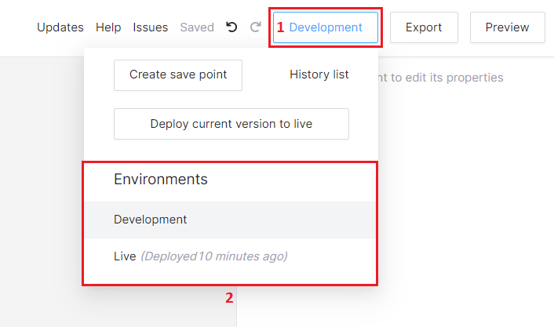

# Nodes

Zero One contains 3 custom n8n nodes, which allow you to write business logic depending on data inside Zero One database

### ZeroOne Trigger

Zero one trigger - is custom webhook trigger, which handles JWT verification and defines input/output schema which then can be used in Frontend workflows

.png>)

#### Input

Input is json schema which allows you specify expected HTTP Request Body structure and validate each request to correspond the described JSON schema. Input Schema does not describe transformation, but validation


Input gets validated on each request


#### Output

Input is json schema which allows you specify expected HTTP Response Body structure. By specifying specifying Output you allow Zero One interpret tyoes and suggest appropriate values in Expression Input


Ouput does validate or transform the response body, its meant to be used for typehints Zero One Expression Inputs


### ZeroOne Database Node

ZeroOne Database Node - allows you to read/update/insert/delete data from Zero One database

