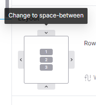
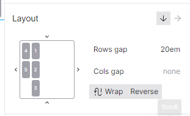

# Layout

Represents `flex-direction` css property. If any of the 2 selected, the container will be displayed as css flex box. [Learn more about flex box](https://developer.mozilla.org/en-US/docs/Web/CSS/CSS\_Flexible\_Box\_Layout/Basic\_Concepts\_of\_Flexbox)

If none is selected (for example, you can unset the layout), then css `display: block` will be used.

Options:

* vertical (default) - represents `column` css, when selected, the container will grow vertically and.
* horizontal - represents `row` css, when selected, the container will grow horizontally.

[Learn more](https://developer.mozilla.org/en-US/docs/Web/CSS/flex-direction)

.png>)

The left side layout section allows you to specify css `justify-content`, `align-items`, `align-content` properties.


You can click on side arrows to change the property values.



### Row/Column gap

Represents `gap` css property.

Sets the gaps (gutters) between rows and columns. You can use `px`, `em`, `rem` or other [CSS units](css-units.md).

[Learn more](https://developer.mozilla.org/en-US/docs/Web/CSS/gap)

### Wrap

Represents `flex-wrap` css property. Enables wrapping. When wrapping active, both row and column gap inputs will be available.

[Learn more](https://developer.mozilla.org/en-US/docs/Web/CSS/flex-wrap)

### Reverse

This will reverse the order of the elements. Represents `row-reverse`, `column-reverse` css values.

[Learn more](https://developer.mozilla.org/en-US/docs/Web/CSS/flex-direction)
